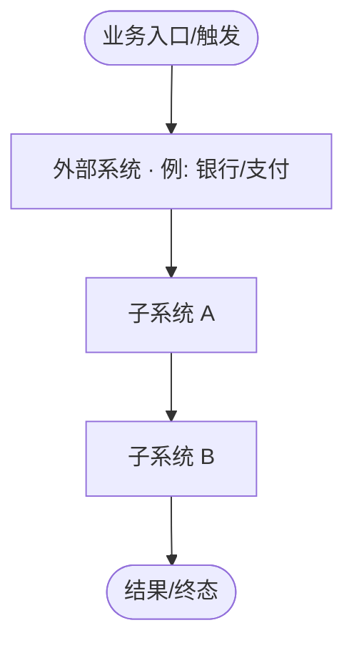
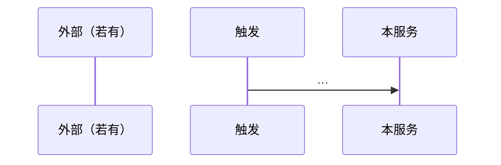

<!-- TEMPLATE: design/l.md — L：架构师视角的工程设计说明书 + 全 UC 设计回应 -->
<!-- 用途：new-plan 在 l-* 且 pipeline 含 design 时 -->
<!-- 视角：架构师/技术专家（不是 PRD 摘要，也不是 class 索引） -->
<!-- 框架参考（精炼吸收，禁止照搬企业长文）：平台概要=约束/原则/多视图/决策；服务概要=角色视角/场景时序/表与关系/接入指南 -->
<!-- Must：约束与原则、可读架构图+读图说明、子系统划分原则、模型/服务抽象、自洽 Traceability、闭合 API 契约、Consistency、Change Surface、Impact -->
<!-- 禁止：架构图无外部边界/无起点/无说明；子系统无划分依据；Traceability 只有 UC-id；跳过模型直接 DD class；API 只有名字无 function 契约 -->
<!-- Design 须自洽可读：不强迫读者来回翻 Requirements；UC 行须带名称+一句话意图 -->
<!-- Permissions / Cross-module 规则同 design/s.md -->
<!-- 详细度判据：DD 须深到「读者照此能直接写 tasks + TDD spec，无需回看代码推断」；任一 UC 仍有「哪个具体 API/哪张表/哪个状态/哪个幂等键」未定 → 不够深，继续补 -->
<!-- 精炼 ≠ 不穷举：穷举性清单（协同矩阵/状态机/Handler·Api·Job 表/幂等键）是详细设计的本体，必须穷尽；灌水指描述性空话（「高可用/可扩展」无落点），二者不可混淆——勿因「怕灌水」而砍穷举 -->

# Design: {Title}

> **架构师视角 · 概要 + 全 UC 设计回应** · 规模：**L**  
> **Impact 必填**。每个 Requirements UC 须有设计回应，且本文**自洽可读**（见 Traceability 列要求）。  
> Permissions：有菜单/页面则详写，否则 `N/A（理由）`。新跨模块依赖须五条加厚。

## Design Intent
<!-- 目标态 vs 现状；阶段依赖（若有）；本设计要守住的架构约束（边界/一致性/不可动系统） -->

## Design Constraints
<!-- 吸收自成熟概要设计「设计约束」：把硬边界写死，避免后文子系统/API 漂 -->
<!-- 无则写 N/A（理由）；有则按条点名，禁止空口号 -->

| 维度 | 约束（可验证） |
|------|----------------|
| 功能 / 范围边界 | 做 / 不做；不可动系统 |
| 质量 / NFR | 延迟、可用性、一致性、幂等等须落到数字或场景（详见 §NFR） |
| 技术栈 / 平台 | 必须用 / 禁止用 |
| 组织 / 合规 / 现场 | 有则写；无则 `N/A` |
| 用户 / 角色能力假设 | 开发/运维/业务使用方需具备的能力或资源前提（toB 常踩坑：假设运维会 K8s、调用方传 ISO 时间字符串、ECS 内存够不 OOM）；无则 `N/A` |

## Design Principles
<!-- 命名原则 + 一句话含义 + 对本计划的落点；禁止堆砌「高可用、可扩展」而无落点 -->
| 原则名 | 含义 | 本计划落点（子系统/机制） |
|--------|------|---------------------------|
| 例：一致性边界优先 | … | … |

## Target Architecture

### 子系统划分原则
<!-- 必填：按什么切（限界上下文 / 一致性边界 / 变更所有权 / 部署进程 / 角色视角…）；备选切法为何不选 -->
- **切分依据**：
- **不采用的切法**：…，因为 …

### 架构图（mermaid，必填）

<!-- 必含：①明确起点/触发 ②外部系统（银行/支付/告警/人等）③内部子系统（可用分层 subgraph）④主路径箭头 -->
<!-- 禁止：只有内部框、外部资金边界缺失、自环糊弄「第三方」、无读图说明 -->



### 读图说明（必填）
1. **起点**：谁触发、从哪进系统  
2. **主路径**：按箭头顺序 3～7 步说清（须与图一致）  
3. **外部边界**：与银行/支付/其它进程的交互落在哪条边上  
4. **本计划变点**：图上哪些框/边是本次新增或改动  

### 架构多视图（按需；复杂系统建议至少补 1 个）
<!-- 吸收自「逻辑/运行/部署/数据」多视图：主图不够时补视图，勿把主册写成百科 -->
<!-- 详细部署/安全可下沉 design-deployment / design-security；此处留可读摘要或链子文档 -->

| 视图 | 本计划是否需要 | 摘要或子文档 |
|------|----------------|--------------|
| 逻辑（服务边界/依赖） | 是（主图已覆盖可写「见上」） | |
| 运行（并发/队列/Job） | | |
| 部署（进程/环境） | | design-deployment / 本文要点 |
| 数据（流向/存储） | | design-database / 本文要点 |

### 关键组合场景（按需）
<!-- 吸收自「能力视图/服务组合场景」：跨子系统怎么串；与 UC 时序互补，勿整份复述 PRD -->
1. **场景名**：参与子系统 → 主路径一句话  

## Architecture Decisions
<!-- 吸收自「架构决策」：概述 / 备选对比 / 影响；短表即可，禁止无对比的口号决策 -->
| 决策 | 选择 | 备选（不选因为） | 影响面 |
|------|------|------------------|--------|
| | | | |

## Subsystem Design

> 每个子系统须能回答：为何是「子系统」、**视角**、**本计划变更**、边界、上游/下游、不变量。  
> 模块骨架（吸收服务概要）：**概述 → 关键场景（可选）→ 契约/流程 → 时序（跨边界必有）**。禁止只列现有包名。  
> 「模块/子系统职责」不再单列速览表——职责/视角/变更/边界全在本节每块自洽，避免与总览表双写漂移（全景看架构图）。

### {子系统名} · {视角}
- **划分归属**：落在「划分原则」的哪一条下  
- **职责 / 功能概述**：  
- **本计划变更**：本次对该子系统改什么（add/change/delete，一句话；无则 `不动`）  
- **上游**（被谁调用/被什么触发）：  
- **下游**（调用谁/写什么）：  
- **对外契约（本计划新增/迁移）**：列出本子系统新建/迁移的 *Api 方法、Handler、Job、事件、uk 约束；无则 `N/A`（集中一处，避免散落正文导致「写设计时漏、评审时才被发现」）  
- **不变量**：  
- **关键量化 / SLA（按需）**：吞吐/延迟/批大小/扫描周期等可验证数字（呼应 §NFR）；纯内部无 SLA 则 `N/A`  
- **关键场景**（配置/审批/运行时等，可选；有 UI 操作流可写步骤要点）：  
- **覆盖 UC**（写 `UC-id · 名称`，勿只写 id）：  
- **UI / Permissions**：有则简述或链到 Permissions 节；无则 `N/A`  
- **新跨模块依赖**：有则五条加厚（或链 Cross-module）；无则 `N/A`  

## Logical Model & Services
<!-- 进入 UC 详细设计之前的技术抽象；禁止跳过本层直接写 Class implement -->
<!-- 表级：关系/职责/关键约束写清；字段级 DDL 可下沉 design-database，但主册须有可读摘要（吸收「表职责+关系说明」） -->

### 领域 / 数据模型（摘要）
| 聚合/表/实体 | 职责 | 与其它表/聚合关系 | 关键状态或约束 | 详细落点 |
|--------------|------|-------------------|--------------|----------|
| | | | | 本文 / design-domain-model / design-database |

### 服务职责（摘要）
| 服务（逻辑名，非必 class） | 职责 | 主要上游 | 主要下游 |
|----------------------------|------|----------|----------|
| | | | |

## Interface Contracts
<!-- 新建/迁移 API 一等公民；主册须写清 function 契约，禁止只有接口名 -->
<!-- compound 可展开 DTO 字段，但不得把「方法签名」整体甩出去导致主册空洞 -->

| API | 方法 | 入参（关键） | 返回 / 错误 | 调用方 → 提供方 | 状态 |
|-----|------|--------------|-------------|-----------------|------|
| | `methodName(...)` | | | | 新建/迁移/保留 |

```text
// 至少为新建/迁移 API 写清伪签名示例：
// InterfaceName.method(arg): Result
//   前置 / 后置 / 错误码（至少列关键）
```

## Integration Guide（按需）
<!-- 吸收自「开发者指南/接入规范」：对外集成时写清接入步骤 + 鉴权/签名/错误码契约；纯内部改动可 N/A -->
- **适用**：对外 API / 回调 / 事件订阅 / SDK 时填写；否则 `N/A（纯内部）`  
- **接入步骤**（授权 → 配置 → 调用/回调 → 验通）：  
- **鉴权 / 签名 / 错误码契约**：签名算法（如 RSA/HMAC）、鉴权头/时间戳/nonce、幂等键、关键错误码表——对外集成是硬契约，勿省；纯内部 `N/A`  
- **契约锚点**：链到上表 API / 事件名  

## Traceability（全 UC · 自洽）
<!-- 必含：UC-id + 名称 + 一句话意图；读者不应为理解「这是什么 UC」去翻 Requirements -->
| UC-id | 名称 | 一句话意图 | 子系统 | 关键接口/表/Job | DD 锚点 |
|-------|------|------------|--------|-----------------|---------|
| UC-S… | | | | | DD-UC-S… |

## Detailed Design by Use Case
<!-- 在 Model & Services + Interface 之后；可引用上文抽象，禁止首次出现未定义的「魔法 Class」而无服务映射 -->
<!-- 写 DD 前先 Explore：每个 UC 涉及的现有 Consumer/Service/表/状态机先摸清（类名+行号），现状不明禁止凭空写机制；先现状后设计，顺序反了会反复补课 -->
<!-- 跨库/跨进程 UC 必须穷举协同点（见下「跨进程/跨库协同点」字段）；停在原则性描述 = 未完成 -->

### DD-{UC-id} · {名称}
- **对应 Traceability 意图**：一句话复述  
- **代码现状锚点**：现有实现链路（Consumer/Service/表/状态机，类名+行号或 file:line；纯新增写 `无`）——先摸清再设计  
- **流程落点**：映射到哪些服务/接口/表（用逻辑名；class 路径可附）  
- **关键规则**：  
- **跨进程/跨库协同点（穷举表，跨库/跨进程必填）**：每个触发点 → 目标进程 → 调用 API/消息 → 参数来源(payload/DTO) → 幂等键 → 现状有无（既有/本次新建）；无跨库则 `N/A`  
- **失败 / 降级**：  
- **跨边界 / 钱 / 状态机**：须时序或状态说明（可图）  



## Consistency & Failure
<!-- 直调 / outbox / 幂等 / 重试 / 对账 / 告警；尽量场景化，避免只剩原则口号 -->
| 场景或维度 | 机制 | 失败表现 | 检测 / 恢复 / 告警 | 决策号 |
|------------|------|----------|---------------------|--------|
| | | | | |

## Change Surface
| 层 | 路径 / 符号 | 动作 |
|----|-------------|------|
| | | |

## Impact & Follow-up Checks
| 影响面 | 说明 | 后续重点检查 |
|--------|------|--------------|
| | | |

## Permissions & AuthZ
<!-- 计划级汇总；无 UI 则 N/A（理由） -->
| 资源 | 权限码 | 默认角色 | 授权方式 | 备注 |
|------|--------|----------|----------|------|

## Cross-module Dependencies
<!-- ①依赖什么 ②契约 ③失败行为 ④归属 ⑤时序 -->

## Open Issues
<!-- 吸收自「尚需解决的问题」：未决项显式挂出，禁止假装已设计完 -->
| 问题 | 阻塞谁 | 建议下一步 | Owner |
|------|--------|------------|-------|
| | | | |

## NFR（非功能需求 · 量化目标）
<!-- 非功能需求是架构硬约束，独立于 Risk；必须落可验证数字或明确场景 -->
<!-- 禁止只写"高性能/高可用/可扩展"等口号而无落点；与 Design Constraints「质量/NFR」行呼应 -->
| 维度 | 量化目标（示例） | 验证方式 |
|------|------------------|----------|
| 性能（延迟/吞吐） | P95 ≤ Xms / 单批 ≤ N 条 / QPS ≥ N | 压测 / 监控 / 单测断言 |
| 可用性 | ≥ 99.X% | 健康检查 / SLA 看板 |
| 一致性 / 幂等 | 跨库最终一致 ≤ Xmin；幂等键 uk | 对账 job / uk 约束 / 状态机守卫 |
| 恢复（RTO/RPO） | RTO ≤ Xmin / RPO ≤ Xh | 演练 / binlog 备份恢复 |
| 资源占用 | 堆 ≤ XGB / agent 端口 / 不动系统 | 启动参数 / 监控告警 |

## Risks & Deployment 要点
| Risk | Probability | Impact | Mitigation |
|------|------------|--------|------------|

## Sub-documents
<!-- 当设计涉及 3+ 独立关注点时拆分；命名 design-{subname}.md -->
<!-- 常见：design-domain-model / design-database / design-security / design-architecture -->
<!-- design-architecture / design-conventions 由 establishing vs referencing 驱动 -->
<!-- 子文档共享父文档审批：design: approved 覆盖所有 design-*.md -->
<!-- 主册仍须保留约束/原则、划分原则、读图说明、模型/服务摘要、方法级 API、自洽 Traceability；禁止主册变纯索引 -->
| 子文档 | 内容 |
|--------|------|
| [design-domain-model.md](design-domain-model.md) | （若需要：字段级模型/状态机） |
| [design-database.md](design-database.md) | （若需要：DDL/迁移） |
| [design-security.md](design-security.md) | （若需要） |
| [design-architecture.md](design-architecture.md) | （若需要：语言向架构展开） |
| [design-conventions.md](design-conventions.md) | （若需要） |

## Status: draft
