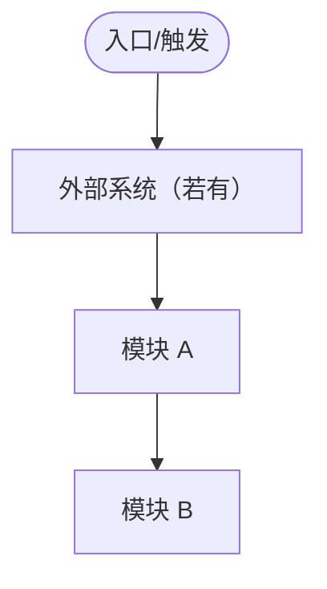
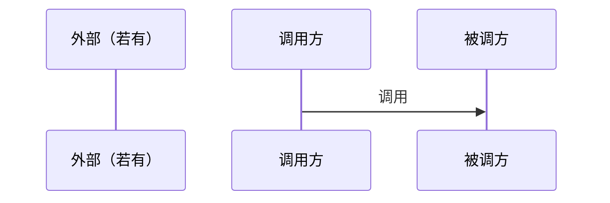

<!-- TEMPLATE: design/m.md — M：架构师视角 · 概要完整 + 关键 UC 详细 -->
<!-- 用途：new-plan 在 m-* 且 pipeline 含 design 时（默认 defaultComplexity=m-feature，主力模板） -->
<!-- 框架吸收（精炼）：约束、读图、模型关系、不变量、方法契约、关键场景时序、Open Issues；禁止企业长文灌水 -->
<!-- Must：可读架构图+读图说明、自洽 Traceability、Model/Service 摘要、关键不变量、API 方法契约、Impact -->
<!-- 禁止：架构图无说明；Traceability 只有 UC-id；跳过抽象直接 class；API 只有名字；NFR/不变量只写口号 -->
<!-- 详细度判据：读者照此能直接写 tasks + TDD spec，无需回看代码推断；任一 UC 仍有「哪个 API/哪张表/哪个状态/哪个幂等键」未定 → 不够深，继续补 -->
<!-- 精炼 ≠ 不穷举：穷举性清单（协同矩阵/状态机/API·Job 表/幂等键）必须穷尽；灌水指描述性空话，勿因「怕灌水」砍穷举 -->

# Design: {Title}

> **架构师视角 · 概要 + 关键详细** · 规模：**M**  
> 每个 UC 须在 Traceability 有落点（含名称+意图）。**Impact 必填**。本文须自洽可读。  
> Permissions：触发详写，否则 `N/A（理由）`。新跨模块依赖须加厚实现细节。

## Intent
<!-- 设计边界与要守住的约束；勿整份复述 PRD -->

## Design Constraints（短）
<!-- 硬边界；无额外约束可一行带过 -->
| 维度 | 约束 |
|------|------|
| 范围 / 不可动系统 | 做 / 不做；点名不可动系统（如某进程永不重启 / 某库只读） |
| 质量 / NFR | 延迟 / 一致性 / 幂等等须落数字或场景（详见 §NFR） |
| 技术 / 平台 | 必须用 / 禁止用 |

## Target Architecture

### 划分要点（可短）
<!-- 模块/边界怎么切；有外部系统须点名；可标配置态 vs 运行时 -->

### 读图说明
1. **起点**：  
2. **主路径**：  
3. **外部边界**：  

## Logical Model & Services（摘要）
| 模型/表或服务 | 职责 | 关系 / 约束 | 备注 |
|---------------|------|-------------|------|
| | | | |

## 关键不变量（轻量）
<!-- 架构师级核心：资金 / 状态机 / 幂等键等必须成立的业务规则；无则 `N/A` -->
- INV-…：…

## Interface Contracts
<!-- 本计划新建/迁移的 *Api 须在此表集中（方法级契约），勿散落正文导致「写设计时漏、评审才发现」 -->
| API | 方法 | 入参（关键） | 返回 / 错误 | 状态 |
|-----|------|--------------|-------------|------|
| | `method(...)` | | | |

## Integration Guide（按需）
<!-- 对外接入写步骤 + 鉴权/签名/错误码契约；纯内部 `N/A` -->
- **接入步骤**（授权 → 配置 → 调用/回调 → 验通）：  
- **鉴权 / 签名 / 错误码**：签名算法 / 鉴权头 / 幂等键 / 关键错误码（对外硬契约）；纯内部 `N/A`  

## Traceability（自洽）
| UC-id | 名称 | 一句话意图 | 子系统/组件 | 接口或表 | 详细节 |
|-------|------|------------|-------------|---------|--------|
| UC-… | | | | | |

## Key Flows
<!-- 跨库/跨进程 UC：写 Flow 前先 Explore 锚定代码现状（Consumer/Service/表，类名+行号）；协同点须穷举（触发点→目标进程→API→参数来源→幂等键→现状有无），勿只画时序停在调用层 -->
### Flow: {UC-id} · {名称}
<!-- 跨边界 / Must UC 必有技术时序；可引用上文服务名；可按角色视角拆多条流 -->

## Consistency & Failure（轻量表）
<!-- 重试 / 幂等 / 降级落到场景；禁止只剩原则口号 -->
| 场景或维度 | 机制 | 失败 → 检测 / 恢复 |
|------------|------|---------------------|
| | | |

## Change Surface
| 层 | 路径 / 符号 | 动作 |
|----|-------------|------|
| | | |

## Key Decisions
<!-- 选 X 而非 Y + 理由 + 影响面；有对比更好 -->
- {决策}: 选 X 而非 Y，因为 Z；影响：W

## Impact & Follow-up Checks
| 影响面 | 说明 | 后续重点检查 |
|--------|------|--------------|
| | | |

## Permissions & AuthZ
<!-- 触发详写 / 否则 N/A（理由） -->
| 资源 | 权限码 | 默认角色 | 授权方式 | 备注 |
|------|--------|----------|----------|------|

## Cross-module Dependencies
<!-- N/A 或：①依赖什么 ②契约 ③失败行为 ④归属 ⑤时序 -->

## Open Issues
| 问题 | 下一步 |
|------|--------|
| | |

## NFR（非功能需求 · 量化）
<!-- 必须落可验证数字；禁止只写"高性能/高可用"；与 Constraints「质量/NFR」呼应 -->
| 维度 | 量化目标 | 验证方式 |
|------|----------|----------|
| 性能（延迟/吞吐） | P95 ≤ Xms / 单批 ≤ N | 压测 / 监控 / 单测 |
| 一致性 / 幂等 | 最终一致 ≤ Xmin；幂等键 uk | 对账 / uk / 状态机守卫 |
| 资源 / 可用性 | 堆 ≤ XGB / ≥ 99.X% | 启动参数 / 监控 |

## Risks
| Risk | Probability | Impact | Mitigation |
|------|------------|--------|------------|

## Sub-documents（按需）
<!-- 模型或表变复杂时可拆；主册仍留摘要与 API 契约 -->
<!-- 子文档共享 design: approved -->

## Status: draft
