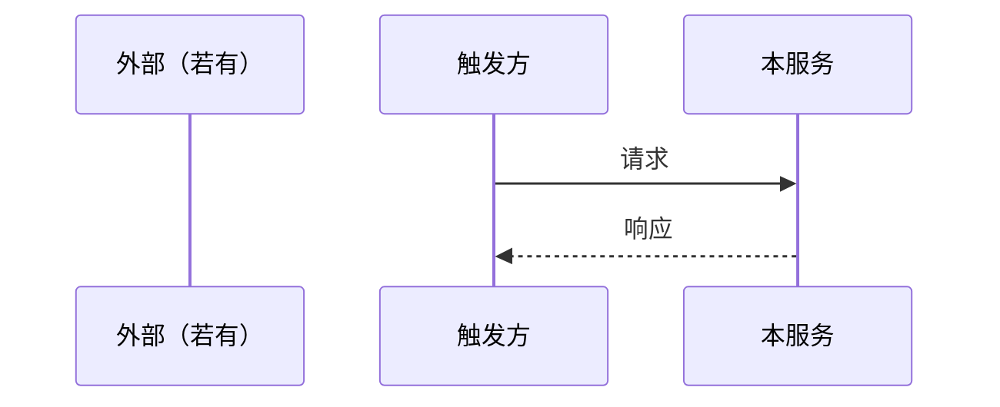

<!-- TEMPLATE: design/s.md — S 规模设计（详细为主，薄概要） -->
<!-- 用途：custom pipeline 含 design 且规模判 S 时，或 agent 从 m 降级时用 -->
<!-- 注意：默认 pipeline s-feature/s-bugfix 不产出 design（见 pipelines.json）；本模板非默认入口，防死代码故补齐硬约束/幂等缺口 -->
<!-- 定位：改点可定位 + 模型/服务 + 契约 + 时序；禁止灌水式全系统架构 -->
<!-- 详细度判据：读者照此能直接写 tasks + TDD spec，无需回看代码推断；任一「哪个 API/哪张表/哪个状态/哪个幂等键」未定 → 不够深，继续补 -->
<!-- 精炼 ≠ 不穷举：穷举性清单（协同点/状态机/API 表/幂等键）必须穷尽；灌水指描述性空话，勿因「怕灌水」砍穷举 -->
<!-- Must：Intent、自洽 Traceability、Change Surface、Impact、Model、Service/API（含方法）、Sequence -->
<!-- Permissions：菜单/页面/按钮/管理 API → 详写；否则显式 N/A -->
<!-- Cross-module：新依赖须五条加厚；无则 N/A -->

# Design: {Title}

> **详细设计为主** · 规模：**S** · 绑 UC：{UC-id} · {名称}  
> **Impact 必填**。Permissions：涉及菜单/页面/按钮/管理 API 则详写，否则写 `N/A（理由）`。  
> 新引入其它模块依赖时，须按 Cross-module 五条写全。本文须自洽（UC 写名称，勿只写 id）。

## Intent
<!-- 一句话：为哪个 UC（名称）改什么；边界与约束 -->

## Design Constraints（短）
<!-- 硬边界；纯展示类小改可省略本节 -->
| 维度 | 约束 |
|------|------|
| 范围 / 不可动系统 | 做 / 不做；点名不可动系统（某进程永不重启 / 某库只读） |
| 质量 / NFR | 延迟 / 幂等等须落数字或场景（小改可一行） |

## Traceability（自洽）
| UC-id | 名称 | 一句话意图 | 本设计落点 |
|-------|------|------------|------------|
| UC-… | | | 本文 |

## Change Surface
| 层 | 路径 / 符号 | 动作 |
|----|-------------|------|
| FE / BE / DB / Job | | add / change / delete |

## Impact & Follow-up Checks
<!-- 一律必填；可短，禁止省略 -->
| 影响面 | 说明 | 后续重点检查 |
|--------|------|--------------|
| | | |

## Permissions & AuthZ
<!-- 触发（菜单/页面/按钮/管理 API）→ 填表；否则：N/A（理由） -->
| 资源 | 权限码 | 默认角色 | 授权方式 | 备注 |
|------|--------|----------|----------|------|

## Cross-module Dependencies
<!-- 无新依赖：N/A。有则必填：①依赖什么 ②契约 ③失败行为 ④归属 ⑤时序（可与 Sequence 合并） -->

## Model & DDL
<!-- 无则 N/A；有则写清实体/表/关键字段或状态；有关联表时点明关系职责 -->

## Service / API
<!-- 禁止只有 class 名；须有方法级契约；对外接入可附 2～4 步接入要点。先 Explore 锚定现有 Service/Consumer（类名+行号）再写，禁止凭空设计 -->
```text
// ServiceOrApi.method(args) -> Result
// 前置 / 后置 / 错误码（关键）
```

## Sequence: {UC-id} · {名称}



## Consistency / 幂等（按需）
<!-- 涉及钱 / 状态机 / 跨库时必填：幂等键 / 重试 / 降级；纯展示类改动 `N/A`。跨库/跨进程协同须穷举（触发点→目标→API→幂等键→现状有无），停在原则 = 未完成 -->

## Key Decisions（可选）
<!-- 有取舍时记：选 X 而非 Y，因为 Z -->

## Open Issues（可选）
<!-- 未决项显式写出；无则省略本节 -->

## Risks（可选）

## Status: draft
