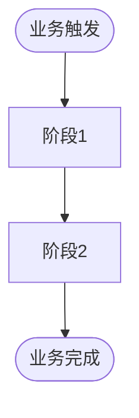
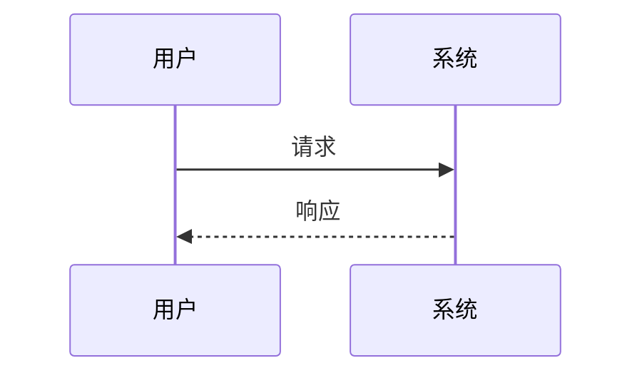
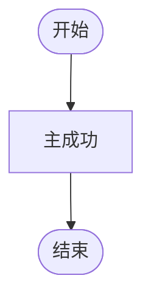
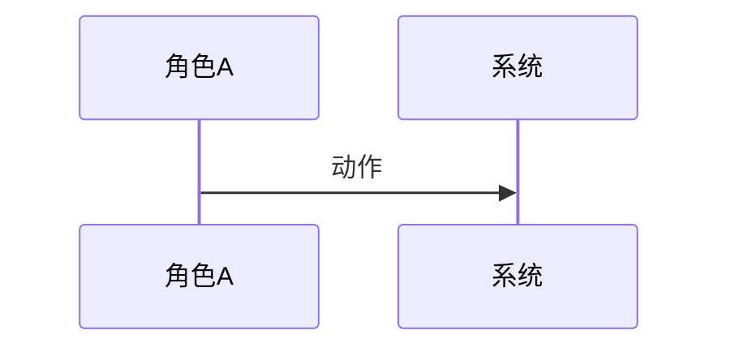

<!-- TEMPLATE: requirements/l.md — L 规模产品需求说明书（PRD）结构模板 -->
<!-- 权威模板：供 new-plan 在 l-* 时生成计划内 requirements.md -->
<!-- 定位：产品需求说明书（PRD），不是简易需求摘要 -->
<!-- 模型：Business Process Overview → User Story（源头）→ Use Case（落地）→ tasks/测试/验收引用 UC-id -->
<!-- 负面约束：禁止仅有 Problem + WHEN/THEN；禁止无端到端流程总览；禁止 Story 下无 UC；可拆 requirements-{topic}.md -->

# Requirements: {Title}

> **产品需求说明书（PRD）** · 规模：**L**  
> **User Story** = 价值源头；**Use Case** = 验收落地（主成功 + 扩展/异常）。二者缺一不可。  
> **Business Process Overview** 在全部 Story **之前**（跨角色端到端地图）。  
> UC 内 **活动图 / 时序图** 挂在对应 Use Case 下。  
> 后续 `design` / `tasks` / `test-plan` / 验收均以 **业务流程 + UC-id** 为细化源头。

## Problem Statement
<!-- 业务背景、痛点量化（若可）、不做的代价 -->

## Alignment with Product / Project Docs
<!-- docs/requirements.md、docs/steering/product.md、roadmap 等；无则 N/A -->
- 

## Users & Roles
| 角色 | 诉求 | 优先级 |
|------|------|--------|
| **Primary** | | |
| **Secondary** | | |
| **Other** | | |

## Goals
- 
## Non-Goals
- 

## Success Metrics
- {指标 1}
- {指标 2}

## Business Process Overview（业务流程总览）
<!-- L：端到端主链必填；可用泳道；节点标注 Story id；复杂时可拆 requirements-flow-*.md 并在此索引 -->

### 主链（活动图）

### 关键协作（时序图 · 可选但推荐）

### 主链说明
| 阶段 | 负责角色 | 关联 Story | 说明 |
|------|----------|------------|------|
| | | S1 | |

## User Stories & Use Cases

> Story 提出需求；其下 Use Case 把验收标准具体化（含异常）。禁止只有 Story 列表。

### User Story S1: {Title}

**As a** [role], **I want** [capability], **so that** [benefit].

#### Use Case UC-S1-01: {用例名称}
| 项 | 内容 |
|----|------|
| 参与者 | |
| 前置条件 | |
| 后置条件 | |
| 触发入口 | {页/菜单/API — 供 Entry Coverage} |

**主成功场景（Happy Path）:**
1. 
2. 
3. 

**扩展 / 异常流:**
- 2a. 
- 3a. 

**业务规则:**
- 

#### Use Case UC-S1-02: {如有第二用例}

### User Story S2: {Title}
<!-- 同上：Story → 一个或多个 UC-S2-* -->

## Traceability（驱动下游）
| Story | UC-id | Persona | UI Entry | tasks / test-plan |
|-------|-------|---------|----------|-------------------|
| S1 | UC-S1-01 | | | 引用此 UC-id |

## Compound Documents（可选）
- [ ] `requirements-flow-{topic}.md` — 超长流程总览拆分
- [ ] `requirements-{topic}.md` — 按主题拆分 Story/UC

## Non-Functional Requirements

### Performance
- 
### Security
- 
### Reliability
- 
### Observability
- 

## Dependencies
- 

## Risks
| Risk | Probability | Impact | Mitigation |
|------|-------------|--------|------------|
| | | | |

## Out of Scope
- 

## Status: draft
