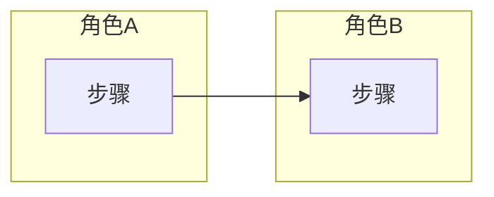
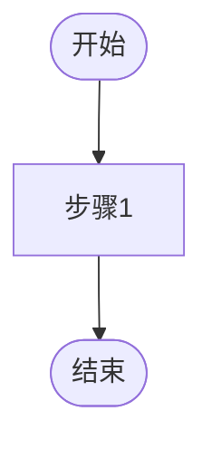

<!-- TEMPLATE: requirements/m.md — M 规模产品需求说明书（PRD）结构模板 -->
<!-- 权威模板：供 new-plan 在 m-*（或自定义含 requirements 的 fallback）时生成计划内 requirements.md -->
<!-- 定位：产品需求说明书（PRD），不是简易需求摘要 -->
<!-- 模型：Business Process Overview → User Story（源头）→ Use Case（落地）→ 下游 tasks/测试/验收引用 UC-id -->
<!-- 负面约束：禁止仅有 Problem + User Story + 几条 WHEN/THEN；禁止无流程总览；禁止 Story 下无 Use Case -->

# Requirements: {Title}

> **产品需求说明书（PRD）** · 规模：**M**  
> **User Story** = 要去哪里（价值源头）；**Use Case** = 怎么开、遇红绿灯/堵车/抛锚怎么办（落地保障）。  
> **业务流程总览**在 Story **之前**；UC 内活动图/时序图挂在对应 Use Case 下。  
> 下游 `tasks` / 测试 / 验收必须以 **UC-id** 为细化依据（可回溯 Story）。

## Problem Statement
<!-- 痛点、现状、为何现在做 -->

## Users & Roles
| 角色 | 诉求 |
|------|------|
| **Primary** | |
| **Secondary** | |

## Goals
- 
## Non-Goals
- 

## Business Process Overview（业务流程总览）
<!-- 端到端主链 / 泳道；跨角色；可在节点旁标注将展开的 Story id -->
<!-- 禁止把总览只塞进某一个 Story -->

<!-- 可选：补充文字说明主链、分支、终止条件 -->

## User Stories & Use Cases

> 一个 User Story 可衍生 **一个或多个** Use Case。禁止只有 Story 没有 UC。

### User Story S1: {Title}

**As a** [role], **I want** [capability], **so that** [benefit].

#### Use Case UC-S1-01: {用例名称}
| 项 | 内容 |
|----|------|
| 参与者 | |
| 前置条件 | |
| 后置条件 | |

**主成功场景（Happy Path）:**
1. 
2. 
3. 

**扩展 / 异常流:**
- 2a. {条件} → {系统提示或分支}
- 3a. {条件} → {系统行为}

**业务规则 / 数据:**
- 

#### Use Case UC-S1-02: {如有}
<!-- 同上结构 -->

### User Story S2: {Title}
**As a** …, **I want** …, **so that** ….

#### Use Case UC-S2-01: {用例名称}
<!-- 主成功场景 + 扩展 -->

## Traceability（Story → UC → 下游）
| Story | Use Case | 入口/Persona（若有） | 备注 |
|-------|----------|----------------------|------|
| S1 | UC-S1-01 | | tasks/verify 引用此 UC-id |

## Non-Functional Requirements

### Performance
- 

### Security / Reliability / Observability
- 

## Dependencies
- 

## Risks
| Risk | Mitigation |
|------|------------|
| | |

## Out of Scope
- 

## Status: draft
