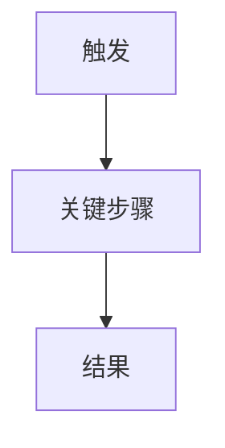

<!-- TEMPLATE: requirements/s.md — S 规模产品需求说明书（PRD）结构模板 -->
<!-- 权威模板：供 new-plan 在 s-* 且 pipeline 含 requirements 时生成计划内 requirements.md -->
<!-- 定位：产品需求说明书（PRD），不是简易需求摘要 -->
<!-- 模型：Business Process Overview → User Story（源头）→ Use Case（落地：主成功+扩展） -->
<!-- 注意：HTML 注释是填写指引，生成时替换为实际内容 -->

# Requirements: {Title}

> **产品需求说明书（PRD）** · 规模：**S**  
> **User Story 是源头**；**Use Case 是落地保障**（主成功场景 + 扩展/异常）。二者缺一不可。  
> 禁止只写价值句或只写 WHEN/THEN 而无流程总览与用例步骤。

## Problem Statement / Value
<!-- 一段话：用户痛点与本功能要交付的价值 -->

## Users & Roles
- **Primary**: {角色} — {诉求}

## Goals
- 
## Non-Goals / Out of Scope
- 

## Business Process Overview（业务流程总览）
<!-- S：1 张极简端到端主链；放在 User Story 之前 -->

## User Stories & Use Cases

### User Story S1: {简短标题}
**As a** {角色}, **I want** {能力}, **so that** {收益}.

#### Use Case UC-S1-01: {用例名}
| 项 | 内容 |
|----|------|
| 参与者 | |
| 前置条件 | |

**主成功场景:**
1. 
2. 

**扩展 / 异常:**
- {步骤号}a. {条件} → {系统行为}

<!-- 可选：本 UC 的 mermaid 活动图 -->

## Acceptance Criteria（可测汇总）
<!-- 可引用 UC 步骤；下游 tasks/verify 应引用 UC-id -->
- [ ] UC-S1-01 主成功场景可演示通过
- [ ] UC-S1-01 至少一条扩展场景可验证

## Non-Functional (optional for S)
- {无额外 NFR 时写「无额外 NFR」}

## Status: draft
